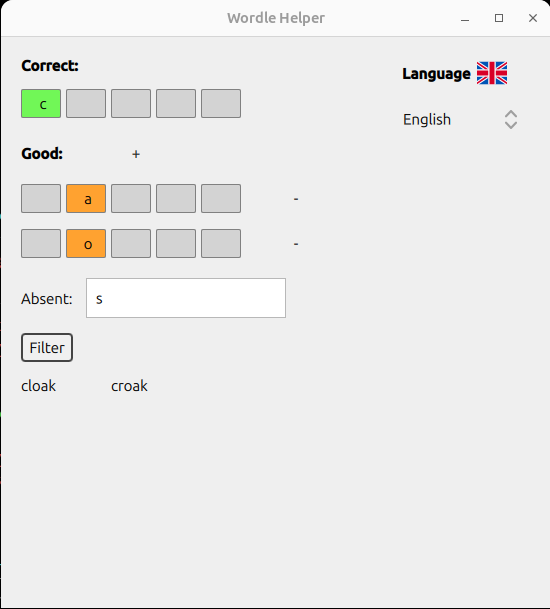

# Wordle Helper

A desktop application built with **Qt (QML + C++)** that helps filter possible 5-letter words based on Wordle-style constraints.

The application supports both **English and French dictionaries**, and allows dynamic language switching.

---

## Features

- Qt Quick (QML) user interface
- C++ backend for fast word filtering
- Scrollable grid of possible words
- English / French language switching
- Proper handling of duplicate letters
- Responsive layout

---

## Display Preview

## How It Works

The application filters words according to Wordle rules:

- **Correct letters**: must be at the exact position.
- **Good letters**: must exist in the word but not at that position.
- **Absent letters**: must not appear in the word.
- **Duplicate letters**: properly handled (minimum occurrences enforced).

The filtering logic is implemented in C++ inside the `WordFinder` class.

---

## Architecture

### 🔹 Frontend (QML)

- Handles UI layout
- TextFields for constraints
- GridView for displaying results
- ComboBox for language selection
- Communicates with C++ backend via `Q_INVOKABLE`
- Button to filter possible words
- Button "+" to allow more than 1 row for misplaced letters

### 🔹 Backend (C++)

**WordleBackend**
- Exposed to QML
- Updates constraints
- Emits `possibleWordsChanged()`
- Switches dictionaries dynamically

**WordFinder**
- Loads dictionary file
- Applies filtering logic
- Supports `reloadWords()` for language switching

---

## Language Switching

The language can be changed at runtime using a ComboBox.

When switching:
- The dictionary file is reloaded
- The word list is refreshed
- The UI updates automatically

---

## Requirements

- Qt 6 (Qt Quick + Qt Quick Controls 2)
- C++17 or newer
- Qt Creator (recommended)

---

## How to Build & Run

1. Open the project in **Qt Creator**
2. Ensure dictionary files exist:
   - `words_list.txt` (English)
   - `mots.txt` (French)
3. Build and run the project

---

## Possible Improvements

- Automatic filtering on text change
- Clear button to clear all inputs
- Dark mode
- Word length selection
- Better styling/theme
- Use Qt resource system (`.qrc`) instead of absolute file paths
- Add random word suggestion feature

---

## License

This project is for educational purposes.
